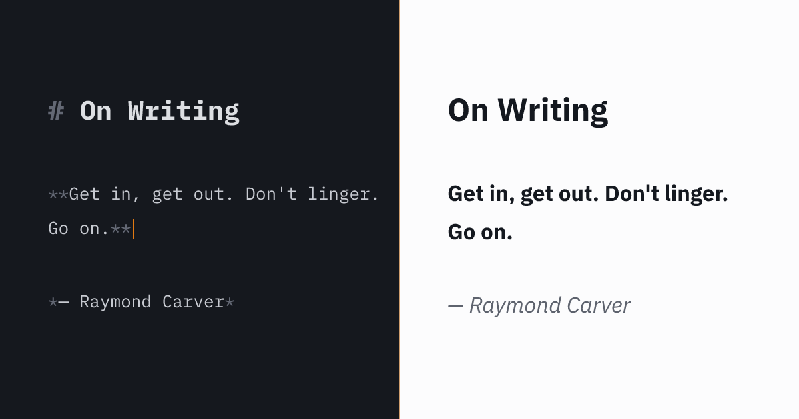

# Carver
#### A markdown editor. Minimal by design, private by default, delightful by nature.

| Setting | Options |
|---------|---------|
| Editing theme | Dark / Light |
| Editing caret | Line / Block / Underscore |
| Reading theme | Dark / Light |
| Reading font | Sans-serif / Serif |
| Tint | Cool (blue) / Warm (amber/orange) — applies globally to caret, divider, toggle, controls |
| Text size | Small (14px) / Medium (16px) / Large (18px) |
| Focus mode on desktop | Forces single-column layout |
| Match scroll positions | Aligns top of both panes |

## Privacy
- Runs entirely in the browser. No accounts, no servers, no data leaves the page.
- Fonts (IBM Plex Mono, Sans, Serif) are self-hosted as woff2 files.
- Your document and settings are saved to `localStorage`.

## Stack
- Vite (vanilla JS)
- CodeMirror 6
- markdown-it
- Vitest (unit tests)
- Playwright (E2E tests, requires local install — see below)
